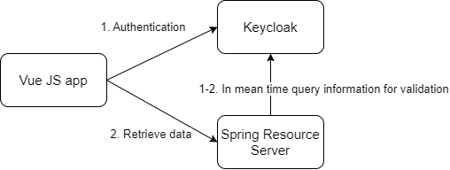

# OpenID Connect using Keycloak 
## Proof of Concept

### Requirements
* Java 20
* Docker compose 3
* Node 18.17.1
* NPM 10.1.0

### Architecture



## Setup (Windows 10)

### 1. Start Keycloak
```console
docker-compose -f .\keycloak\docker-compose.yml up
```
OR
```console
cd keycloak
docker-compose up
```

### 2. Start Spring Resource Server
```console
.\spring-resource-server\gradlew.bat -p .\spring-resource-server clean build bootRun
```
OR
```console
cd spring-resource-server
gradlew.bat clean build bootRun
```

### 3. Start Vue Js
```console
npm --prefix .\vue-project\ install (!) Doesn't work on Windows
npm --prefix .\vue-project\ run dev
```
OR
```console
cd vue-project
npm install
npm run dev
```

## The PoC
Go to localhost:5173 \
If you try to open a Secured page, you will be prompted to enter credentials\
There are two predefined users with different roles:\
With role 'vue-user'
```console
username: vue
password: vue
```
Without
```console
username: vue1
password: vue1
```

The latter can not access the Secured page and will be redirected to Unauthorized page

In the successful scenario you must see following text at the Secured page, and also be able to toggle OIDC tokens
```text
This is Secured page. You can see it only if you are authenticated and have the role 'vue-user'

Hello dear Hunter. The treasure you are looking for located at !@#$%^&
``` 


### Terminating the project
* Terminate processes from command line using ctrl+C
* Remove docker container
```console
docker-compose -f .\keycloak\docker-compose.yml rm -f
```

### Export Keycloak realm configuration
```console
docker exec -it <container-id> bash

/opt/keycloak/bin/kc.sh export --dir /opt/keycloak/data/import --realm vue --users realm_file

docker cp <container-id>:/opt/keycloak/data/import/vue-realm.json c:/dev/vue-realm.json
```